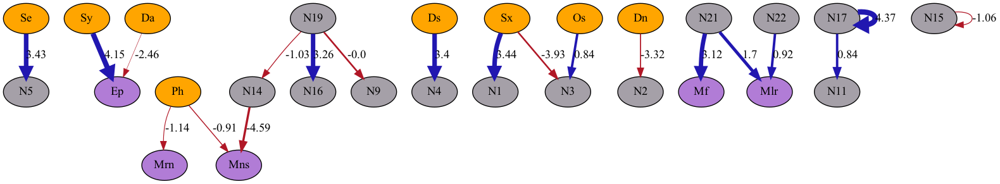
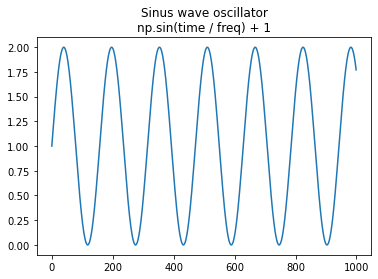

# GenSim
[](https://github.com/adradr/gensim/actions/workflows/docker-build-push.yml)
## Genetic simulation of evolution

This game would like to create a simulation enviroment for simple genetic evolution. Each creature has multiple input and output neurons for percieving its enviroment and interact within it.

Based on selection criteria at the each of the rounds a creature can survive and create an offspring with a possible mutation in its genes.

### Enviroment
- X * Y size pixels grid
- Each pixel can host a single individual
- Selection criteria should be defined based on areas of the grid 

The enviroment is made up of an X times Y **pixel grid**. Time is divided for **rounds**, which gives an opportunity for each creature to fulfill the **selection criteria**. At the start of the simulation a **population size** of n creatures is defined. After each round creatures are evaluated for the selection criteria and if they success can **create offsprings** for the next round with a **mutation** probability. 

 Creatures can move around in the enviroment based on their action neuron outputs. A pixel can only host a single creature on it, so creatures can be blocking each other.

 

## Creatures

Each creature is made up of neurons. Neurons can help the creature to sense and interact with the enviroment. Synapses make connections between between sensory and action neurons and optionally route through internal neurons.

Creatures are initially created with a specific number of synapses between these neurons. This greatly effects the intelligence of the creatures. 

Each creature holds the information of its genes (number of synapses) and has a different color based on this information, so the genetic difference is visible on the simulation. This information is stored in a numpy array as below:

### Genetic structure of creatures
```
[source_type][from_neuron_id][destination_type][to_neuron_id][synapse_weight]

source_type(0,1) = if the input comes from a sensory or internal neuron

from_neuron_id = the unique id of the source neuron

destination_type = if the output goes a sensory or internal neuron

to_neuron_id = the unique id of the destination neuron

synapse_weight = the weight of the connection
```

### Neuron inputs/outputs

To calculate the actions taken in each step for each creature the following calculations are applied inside a creatures genome:

```
| Sensory neurons output                            |  0..1 | 
| Action neurons output       tanh(sum(inputs)) =>  | -1..1 | 
| Internal neurons output     tanh(sum(inputs)) =>  | -1..1 | 
| Connection weights                                | -5..5 | 
```

Action neurons are firing based on their `tanh(sum(inputs))` with a value between -1..0 or 0..1. This value is also used as in its absolute value form to define the probability of firing for that neuron.

### Example of a genome structure




### Oscillator of creatures

Creatures are using a synthetic internal oscillator which influences their sensory and action outputs. The underlying formula is a simple sinus wave to replicate primitive a circadian rythm.



### Additional information on neuron math

- Sensory neurons emit a value between `0..1`
- Internal neurons are outputting `=tanh(sum(input)) = -1..1`
- Action neurons are acting upont `=tanh(sum(input)) = -1..1`
- Connections has a weight between `-5..5`

### Type of neurons
- sensory of internal or enviromental state
- internal neuron
- action neuron to interact in the enviroment

### Sensory Neurons
0. x_loc - location on the X axis
1. y_loc - location on the Y axis
2. dst_north - distance from north
3. dst_south - distance from south
4. dst_west - distance from west
5. dst_east - distance from east
6. density_around - density around: how many individuals are around (8 pixels)
7. view_forward - view ahead forward: is there an individual in the next 3 pixels
8. pheromones_around - pheromons detected around (5x5 pixels)
9. age - age
10. oscillator - internal oscillator signal

### Action Neurons
0. move_fr - move forward/reverse (based on previous direction)
1. move_rn - move random
2. move_lr - move left/right
3. move_ew - move east/west
4. move_ns - move north/south
5. set_osc - set oscillator period
6. emit_pheromone - emit pheromone

### Reproduction and mutation of creatures

All creatures are evaluated based on the selection criteria. These survivor creatures can reproduce by creating offsprings based on a random selection from their gene pool. This inheritance can introduce an amount of mutation in the inherited genome and allowing to create new traits for offsprings. 

The mutation can happen based on a mutation rate, that controls the probability of a gene getting mutated in the offspring's genome. In case the a mutation happens then that particular gene gets randomly regenerated as it happens in the initialization of a new creature. 